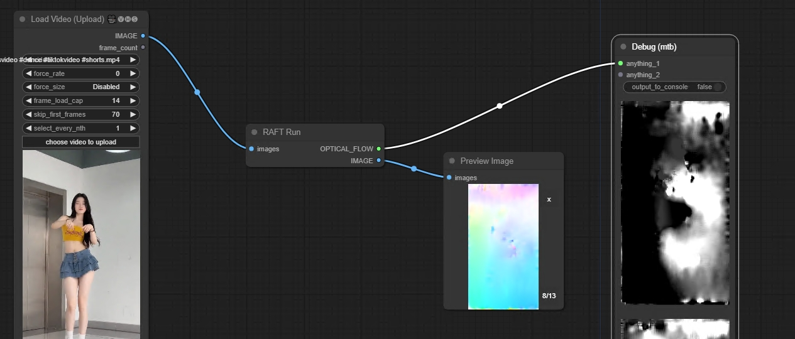
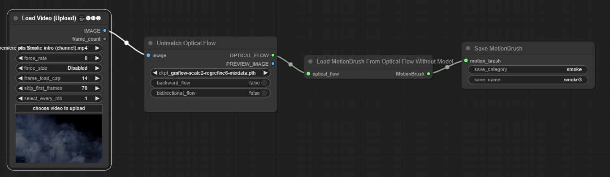

Generate Optical Flow By [RAFT](https://github.com/princeton-vl/RAFT)

1. Basic Workfow

https://github.com/chaojie/ComfyUI-RAFT/blob/main/workflow.json

2. Save MotionBrush To Disk

https://github.com/chaojie/ComfyUI-RAFT/blob/main/workflow_savemotionbrush.json